<div align="center">

<a href="https://github.com/ishandutta2007/Awesome-Invoice-OCR-Platform">
  
</a>

# 🧾 Awesome Invoice OCR Platform

### 🚀 Curated Directory of Commercial SaaS & Open-Source Deep Learning Systems for Intelligent Document Processing (IDP), Field Extraction, Line-Item Parsing & Accounts Payable (AP) Automation

<p align="center">
  <a href="https://github.com/ishandutta2007/Awesome-Awesome-Awesome"></a><a href="https://discord.gg/jc4xtF58Ve"></a>
  <a href="https://github.com/ishandutta2007/Awesome-Invoice-OCR-Platform/stargazers"></a>
  <a href="https://github.com/ishandutta2007/Awesome-Invoice-OCR-Platform/network/members"></a>
  <a href="https://github.com/ishandutta2007/Awesome-Invoice-OCR-Platform/blob/main/LICENSE"></a>
  <a href="https://github.com/ishandutta2007/Awesome-Invoice-OCR-Platform/pulls"></a>
  <a href="https://github.com/ishandutta2007"></a>
</p>

---

**Last updated: September 2026**

</div>

## 📖 Overview & SEO Keywords

Welcome to the definitive, community-maintained landscape of **Invoice OCR**, **Receipt Recognition**, and **Intelligent Document Processing (IDP)**. This guide indexes state-of-the-art **commercial SaaS APIs** and **open-source AI/ML models** engineered to extract structured data (such as vendor details, invoice numbers, line-item tables, tax breakdowns, totals, and payment metadata) from unstructured financial documents.

> 🔍 **Keywords / SEO Metadata**: Invoice OCR • Intelligent Document Processing (IDP) • Receipt Parsing • Table Extraction • LayoutLMv3 • PaddleOCR • Multimodal LLM OCR • Accounts Payable Automation • AP Workflow • Zero-Shot Document Understanding • Document AI • Optical Character Recognition.

---

## 📑 Table of Contents
- [📊 Market Landscape & Sector Analysis](#-market-landscape--sector-analysis)
- [🏢 SaaS / Hosted Commercial Platforms](#-saas--hosted-commercial-platforms)
- [💻 Open-Source GitHub Projects](#-open-source-github-projects)
- [🛠️ Custom Architecture & Pipeline Best Practices](#️-custom-architecture--pipeline-best-practices)
- [🤝 How to Contribute](#-how-to-contribute)
- [⭐ Star History](#-star-history)
- [⚠️ Disclaimer](#️-disclaimer)

---

## 📊 Market Landscape & Sector Analysis

> 💡 **Market Size & Structure**: The global Intelligent Document Processing (IDP) and Invoice OCR market is estimated at **$3.2B – $3.9B in 2026** (growing at **~25–30% CAGR** toward $10B+ by 2030). The sector is **moderately fragmented** (HHI ~900–1,100, with top vendors holding 38–45% aggregate market share) rather than a winner-take-all monopoly, driven by diverse regional accounting mandates, varying document taxonomies, complex ERP integrations, and localized compliance rules.

---

## 🏢 SaaS / Hosted Commercial Platforms

Below is the comparative breakdown of industry-leading commercial Invoice OCR & IDP platforms, sorted in descending order by **Company Scale (Valuation / Revenue)**:

| 🏢 Platform | 💼 Company Scale (Valuation / Revenue) | 📝 Description & Capabilities | 💵 Starting Pricing | 🎁 Free Tier / Trial Limits |
| :--- | :--- | :--- | :--- | :--- |
| **[ABBYY FlexiCapture / Vantage](https://www.abbyy.com/)** | **~$1B+ Valuation**<br>(~$500M Annual Revenue) | Enterprise-grade IDP suite offering cloud and on-premises OCR, multi-language recognition, and advanced invoice extraction skills. | Starts at **~$3,300/mo** (~$40,000/yr minimum enterprise volume commitment) | **60-day free trial** with **2,000 core pages + 1,000 invoice skill pages** |
| **[Rossum](https://rossum.ai/)** | **$500M Valuation**<br>(~$45M ARR / Acquired by Coupa) | AI-native invoice and document understanding platform with deep learning extraction, validation workflows, and AP automation. | Starts at **$18,000/yr** ($1,500/mo billed annually) for Starter tier | **14-day free trial** (unlimited core testing, no credit card required) |
| **[Ocrolus](https://www.ocrolus.com/)** | **$500M+ Valuation**<br>(~$50M+ ARR / $127M Funding) | Document AI platform focused on financial document analysis, bank statements, and human-in-the-loop verification workflows. | Starts at **~$1,000/mo** minimum platform volume (from ~$0.25–$0.50/page) | **Free trial** limited to **100 pages** of financial document analysis |
| **[Nanonets](https://nanonets.com/)** | **~$150M Valuation**<br>(~$40M+ ARR / $42M Funding) | No-code / low-code document AI platform popular for custom model training, invoice extraction, and workflow automation. | Pay-as-you-go from **$0.10/page** (simple operations from $0.02/run; Growth tier ~$499/mo) | **Free forever plan** with **$50–$200 free credits** (~500 pages, 3–5 users) |
| **[Veryfi](https://www.veryfi.com/)** | **~$60M–$80M Est. Valuation**<br>(~$12.9M Revenue / $18.9M Raised) | Developer-focused OCR and data extraction API specializing in receipts, invoices, and financial documents with mobile SDKs. | **$500/mo** minimum commitment for API (~$0.08–$0.10/doc); Expense App from **$17.50/user/mo** | **Free tier: 100 docs/mo** (API) or **14-day free trial** with full feature access |
| **[Mindee](https://www.mindee.com/)** | **~$40M–$60M Est. Valuation**<br>(~$3.5M ARR / $19.2M Funding) | Developer-centric document AI API with pre-trained invoice and receipt models and easy developer integration. | **€44/mo** (billed annually) or **€49/mo** (billed monthly) for Starter tier | **14-day free trial** with **200 pages / credits** (no credit card required) |
| **[Klippa](https://www.klippa.com/)** | **~$40M–$50M Est. Valuation**<br>(~$21.5M Revenue / Scale-up) | Document and spend-management platform with high-accuracy invoice and receipt OCR (DocHorizon engine). | **€50/mo base + ~€0.25/invoice** (or SpendControl at **€5–€6/user/mo**) | **Free trial with ~50–100 demo credits** upon sign-up with business email |
| **[Hypatos](https://hypatos.ai/)** | **~$30M–$50M Est. Valuation**<br>(~$9.4M Revenue / $11.8M Raised) | AI-powered invoice and document processing platform aimed at enterprise accounts-payable automation. | Starts at **~€500/mo** (outcome-based pricing from ~€0.20–€0.50 per processed document) | **Free Test Demo** with custom invoice data extraction evaluation |
| **[Docsumo](https://www.docsumo.com/)** | **~$25M–$40M Est. Valuation**<br>(~$10.3M Revenue / $3.7M Raised) | Intelligent document processing platform with pre-trained models for invoices and financial documents plus API-first design. | Starts at **$50/mo** (Growth plan at **$500/mo** for 5,000 pages, ~$0.10/page) | **14-day free trial** capped at **100 pages** (1 user, no credit card required) |
| **[Base64.ai](https://base64.ai/)** | **~$15M Valuation**<br>(~$2.4M Revenue / $1.8M Raised) | Document extraction API supporting invoices and a wide range of structured and semi-structured documents. | Pay-as-you-go starting at **$0.01/page** (annual plans from **$100/mo** for 10k pages) | **Free tier with 120 credits** (no credit card required; unlimited Mock API) |

---

## 💻 Open-Source GitHub Projects

The leading open-source OCR engines, layout-aware multimodal architectures, document parsers, and IDP toolkits — sorted in descending order by **GitHub Star Count**:

| 📦 Open-Source Repository | ⭐ GitHub Stars | 📝 Description & Architectural Focus | 🏷️ Primary Language / Stack |
| :--- | :--- | :--- | :--- |
| **[PaddleOCR](https://github.com/PaddlePaddle/PaddleOCR)** | [](https://github.com/PaddlePaddle/PaddleOCR/stargazers) | High-performance open-source OCR toolkit with PP-Structure for table extraction, document layout analysis, and key-information recognition. | Python / C++ |
| **[MinerU (PDF-Extract-Kit)](https://github.com/opendatalab/MinerU)** | [](https://github.com/opendatalab/MinerU/stargazers) | One-stop high-precision document extraction tool converting complex PDFs, invoices, and papers to structured formats. | Python / PyTorch |
| **[Tesseract OCR](https://github.com/tesseract-ocr/tesseract)** | [](https://github.com/tesseract-ocr/tesseract/stargazers) | The classic, battle-tested open-source OCR engine. Reliable character recognition backbone when coupled with layout analyzers. | C++ / C |
| **[Marker](https://github.com/VikParuchuri/marker)** | [](https://github.com/VikParuchuri/marker/stargazers) | Fast, deep-learning pipeline converting PDF documents and scans to structured Markdown and JSON with high fidelity. | Python / PyTorch |
| **[EasyOCR](https://github.com/JaidedAI/EasyOCR)** | [](https://github.com/JaidedAI/EasyOCR/stargazers) | Ready-to-use OCR library supporting 80+ languages with clean Python APIs and PyTorch acceleration. | Python / PyTorch |
| **[LayoutLM / LayoutLMv3 (UniLM)](https://github.com/microsoft/unilm)** | [](https://github.com/microsoft/unilm/stargazers) | Multimodal foundation models combining text, visual features, and 2D spatial layouts for state-of-the-art invoice field extraction. | Python / PyTorch |
| **[Surya](https://github.com/VikParuchuri/surya)** | [](https://github.com/VikParuchuri/surya/stargazers) | Multilingual OCR toolkit with text detection, reading order detection, layout analysis, and table recognition. | Python / PyTorch |
| **[Unstructured](https://github.com/Unstructured-IO/unstructured)** | [](https://github.com/Unstructured-IO/unstructured/stargazers) | Open-source data ingestion pipeline preprocessing PDF documents, invoices, tables, and unstructured files for LLMs and RAG. | Python |
| **[Nougat](https://github.com/facebookresearch/nougat)** | [](https://github.com/facebookresearch/nougat/stargazers) | Meta AI's Neural Optical Understanding for Academic and Document processing, extracting structured text from complex layouts. | Python / PyTorch |
| **[Donut (Document Understanding Transformer)](https://github.com/clovaai/donut)** | [](https://github.com/clovaai/donut/stargazers) | OCR-free vision-to-text Transformer model directly parsing document images into structured JSON representations. | Python / PyTorch |
| **[docTR](https://github.com/mindee/doctr)** | [](https://github.com/mindee/doctr/stargazers) | Seamless, high-performance end-to-end OCR and document parsing library powered by TensorFlow 2 & PyTorch. | Python / PyTorch / TF |
| **[GOT-OCR2.0](https://github.com/Ucas-HaoranWei/GOT-OCR2.0)** | [](https://github.com/Ucas-HaoranWei/GOT-OCR2.0/stargazers) | Unified 580M-parameter General OCR Theory model capable of plain text, format text, table, chart, and fine-grained OCR. | Python / PyTorch |
| **[deepdoctection](https://github.com/deepdoctection/deepdoctection)** | [](https://github.com/deepdoctection/deepdoctection/stargazers) | Orchestrator pipeline connecting layout analysis, table recognition, OCR engines, and token-classification models. | Python |
| **[invoice2data](https://github.com/invoice-x/invoice2data)** | [](https://github.com/invoice-x/invoice2data/stargazers) | Lightweight template and regex-driven invoice data extractor with multi-engine OCR plugins (Tesseract, PDFMiner, etc.). | Python |

---

## 🛠️ Custom Architecture & Pipeline Best Practices

When architecting a production-grade Invoice OCR and document processing system from open components:

```
[ Incoming Invoice (PDF / PNG / TIFF) ]
                 │
                 ▼
┌─────────────────────────────────────────┐
│ 1. Pre-Processing & Normalization       │
│    • Deskew, Denoise, Binarize, Contrast │
│    • Orientation & Page Splitting       │
└────────────────┬────────────────────────┘
                 │
                 ▼
┌─────────────────────────────────────────┐
│ 2. Text Detection & Recognition (OCR)   │
│    • PaddleOCR / Surya / Tesseract      │
│    • Bounding Boxes & Character Confidence│
└────────────────┬────────────────────────┘
                 │
                 ▼
┌─────────────────────────────────────────┐
│ 3. Layout & Structure Understanding     │
│    • LayoutLMv3 / PP-Structure / Donut   │
│    • Table Cell & Line-Item Segmentation │
└────────────────┬────────────────────────┘
                 │
                 ▼
┌─────────────────────────────────────────┐
│ 4. Semantic Parsing & Post-Processing   │
│    • Key-Value Extraction & Regex Rules  │
│    • LLM Zero-Shot Parsing (Schema Match)│
└────────────────┬────────────────────────┘
                 │
                 ▼
┌─────────────────────────────────────────┐
│ 5. Validation & Business Rule Checks    │
│    • Line Total Sum = Subtotal + Tax    │
│    • Vendor Master Data Matching & ERP   │
└────────────────┬────────────────────────┘
                 │
                 ▼
[ Output: Structured JSON / ERP API Sync (SAP, NetSuite, QuickBooks) ]
```

### 💡 Key Technical Takeaways:
- **PaddleOCR (PP-Structure)** and **Surya** provide state-of-the-art table parsing and multilingual bounding boxes without commercial licensing fees.
- **LayoutLMv3 fine-tuning** on domain-specific invoice corpora yields enterprise-grade field extraction accuracy for complex multi-page documents.
- **Hybrid Pipelines**: Combining an open OCR engine with a lightweight structured LLM prompt (e.g. GPT-4o-mini, Claude Haiku, Llama 3) offers maximum flexibility with zero custom templates.

---

## 🤝 How to Contribute

We welcome community contributions, platform reviews, and open-source benchmark additions!
1. 🍴 **Fork the repository**.
2. 🌿 **Create a feature branch** (`git checkout -b feature/new-ocr-platform`).
3. ✏️ **Add/edit entries** in `README.md` keeping formatting consistent.
4. 🚀 **Submit a Pull Request** with clear benchmark or source links.

---

## ⭐ Star History

[](https://star-history.dera.page/#ishandutta2007/Awesome-Invoice-OCR-Platform&type=date&legend=top-left)

---

## ⚠️ Disclaimer

- This repository is a **community-curated index** for educational and architectural evaluation — not a formal endorsement.
- Financial documents contain sensitive and compliance-restricted information. Always verify data privacy policies, SOC2/GDPR compliance, and retention guidelines before sending live financial invoices through third-party APIs.
- Keep a **human-in-the-loop (HITL)** verification layer for high-value or exception-flagged financial accounting workflows.

---

<div align="center">
  <sub>Maintained with ❤️ by the open-source document intelligence community. Star ⭐ this repository if you find it useful!</sub>
</div>

